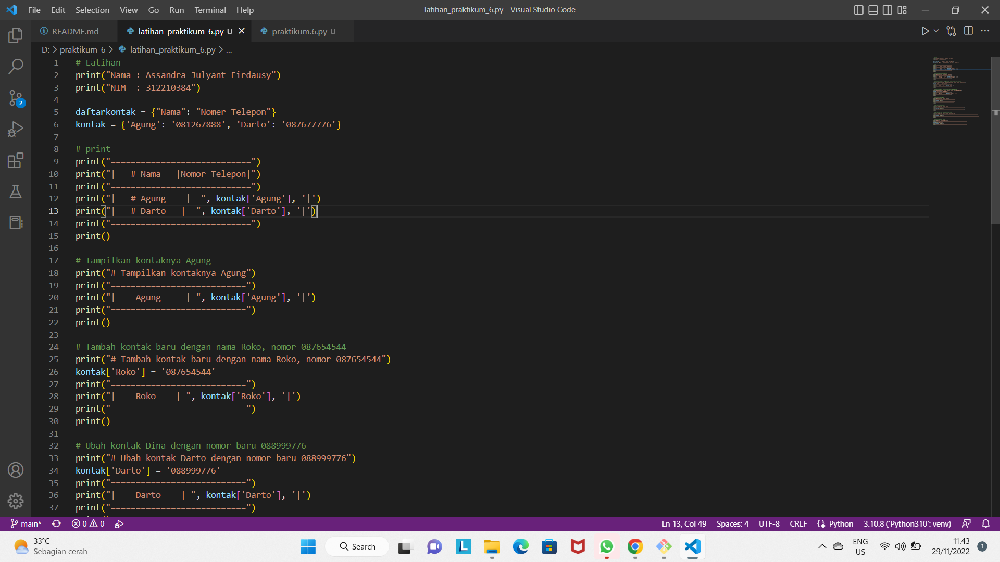
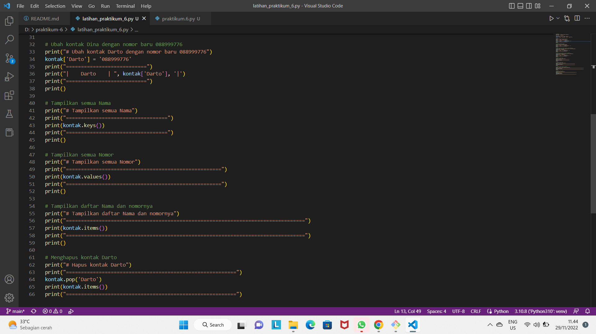
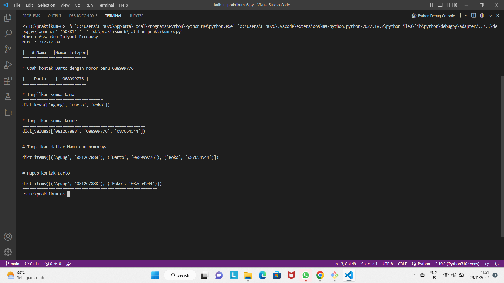
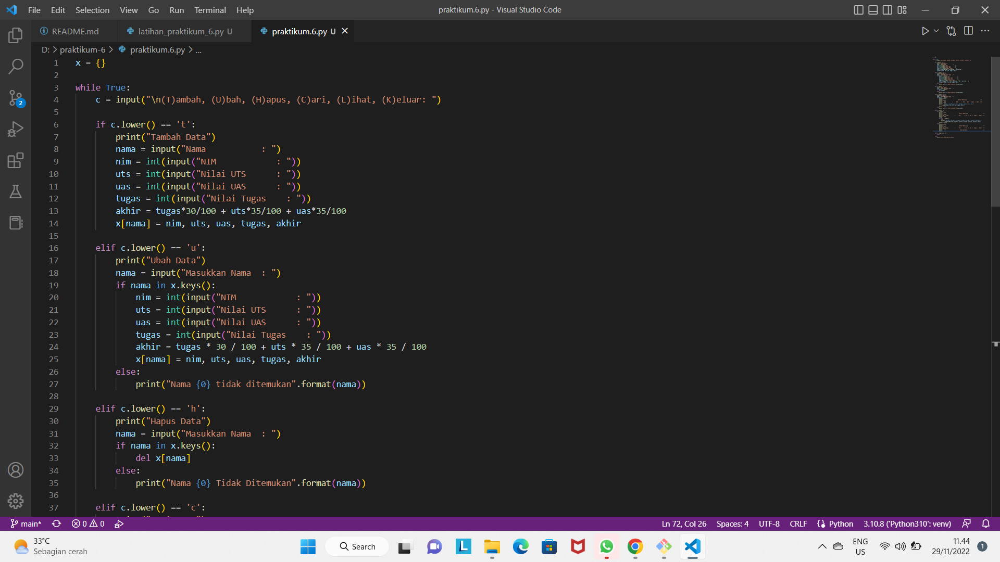
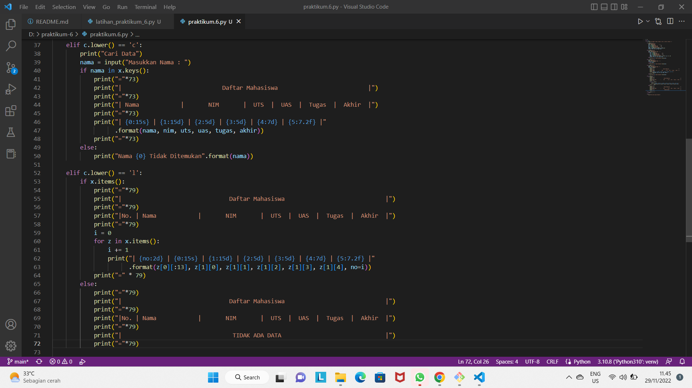
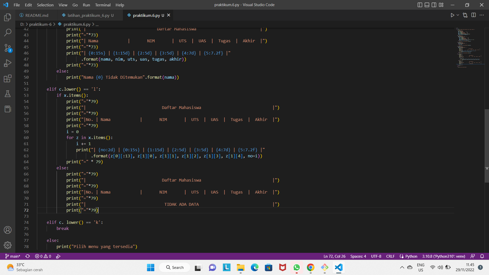
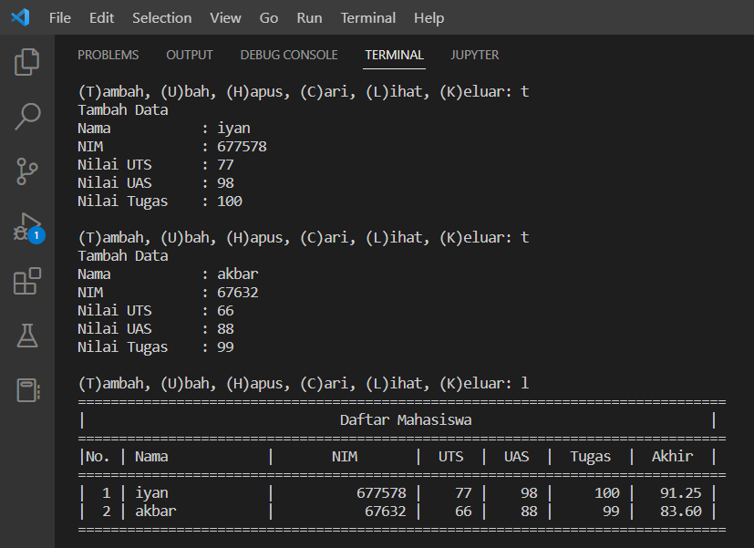
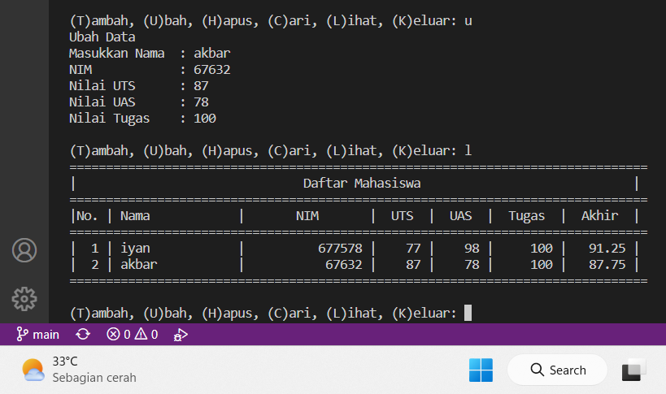
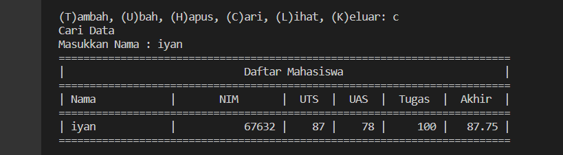
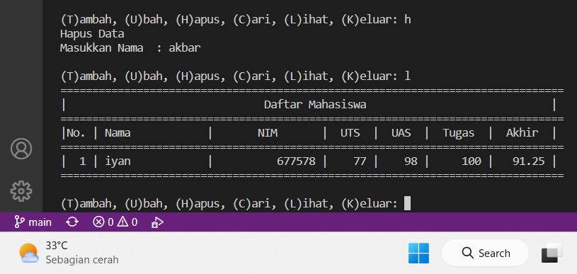

# praktikum-6

# LATIHAN 6

Buat Dictionary daftar kontak

-Nama sebagai key, dan nomor sebagai value
-Tampilkan kontaknya AGUNG
-Tambah kontak baru dengan nama ROKO, nomor 087654544
-Ubah kontak DARTO dengan nomor baru 088999776
-Tampilkan semua Nama
-Tampilkan semua Nomor
-Tampilkan daftar Nama dan nomornya
-Hapus kontak DARTO.

# PROGRAM

# HASIL OUTPUT

# TUGAS PRAKTIKUM 6

Buat program sederhana yang akan menampilkan daftar nilai mahasiswa, dengan ketentuan

-Program dibuat dengan menggunakan Dictionary
-Tampilkan menu pilihan: (Tambah Data, Ubah Data, Hapus Data,Tampilkan Data, Cari Data)
-Nilai Akhir diambil dari perhitungan 3 komponen nilai (tugas: 30%, uts: 35%, uas: 35%)

# PROGRAM DICTIONARY

# Penjelasan

1. Pertama membuat sebuah dictionary kosong yang akan diinput data ketika program dijalankan.
2. Lalu membuat kondisi perulangan dan sebuah keterangan untuk pilihan menu yang akan menjalankan program.
3. Membuat program untuk menambahkan data.
4. Membuat program untuk mengubah data.
5. Membuat program untuk menghapus data.
6. Membuat program untuk mencari data.
7. Membuat program untuk melihat atau menampilkan data.
8. Membuat program untuk menghentikan perulangan.
9. Membuat program untuk apabila memilih pilihan yang tidak ada di menu.

# HASIL OUTPUT PROGRAM

1. tambah data + lihat data

2. ubah data + lihat data

3. cari data

4. hapus data + lihat data

